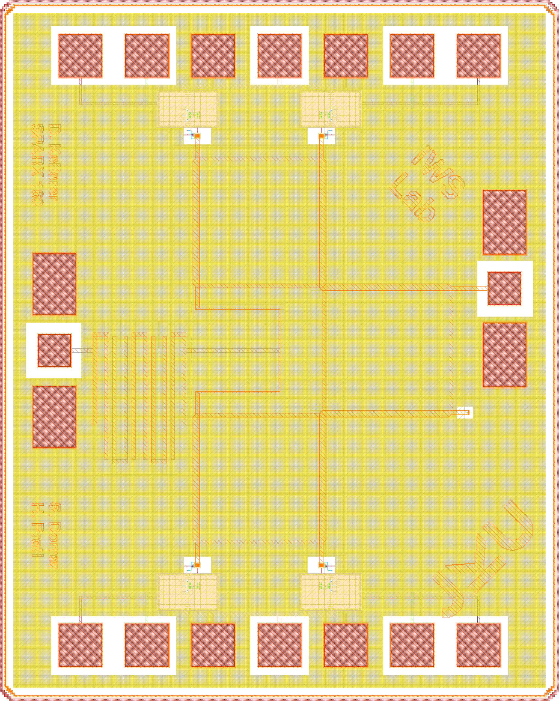
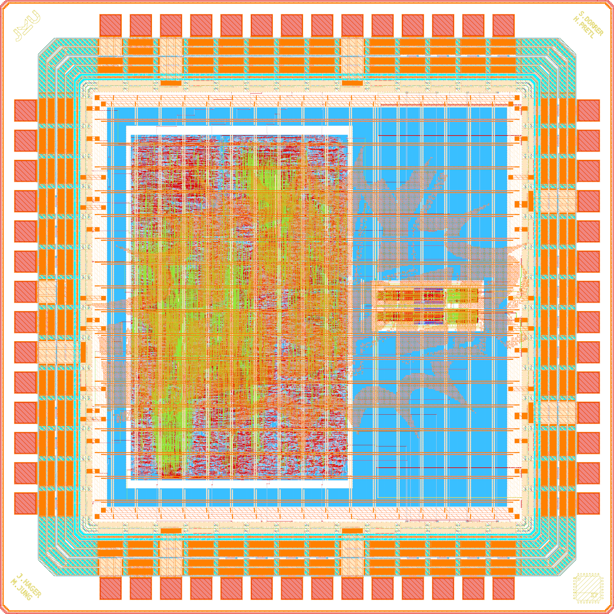
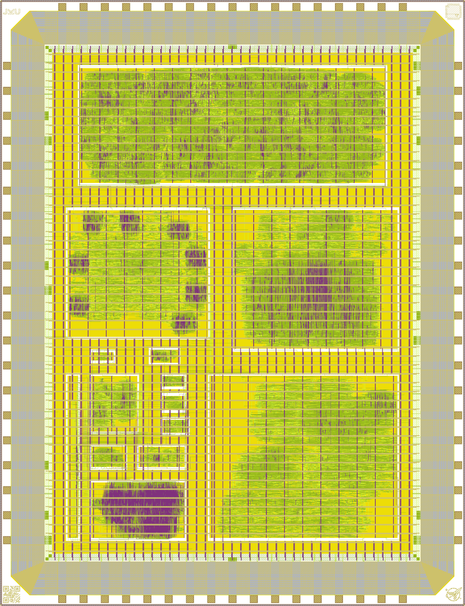
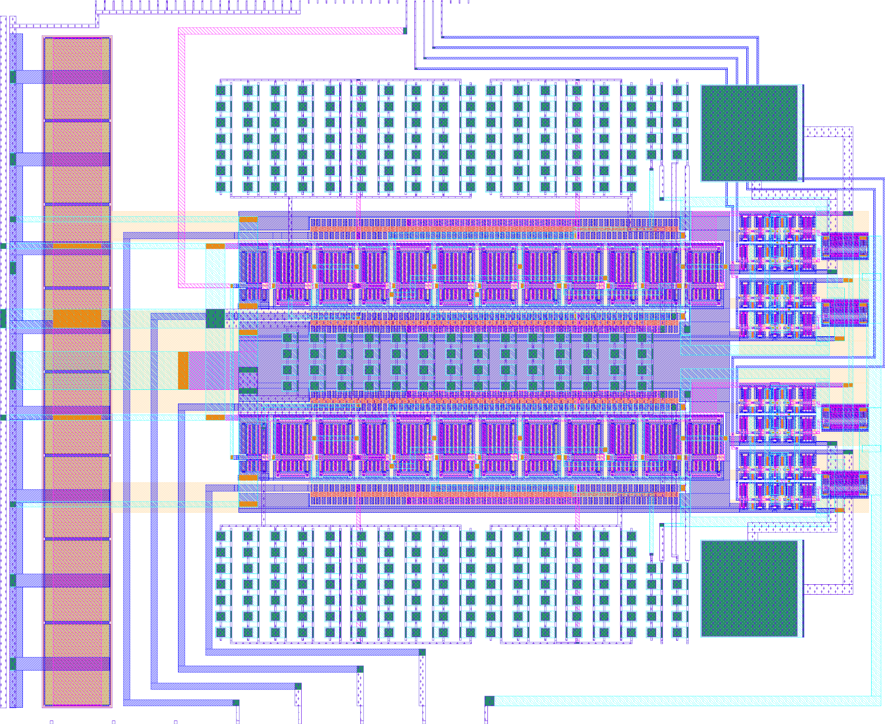

# Open-Source Chip Gallery

(c) 2025-2026 Simon Dorrer

Institute for Integrated Circuits and Quantum Computing (IICQC), Johannes Kepler University (JKU), Linz, Austria

> [!IMPORTANT]
> This repository requires the [IIC-OSIC-TOOLS](https://github.com/iic-jku/IIC-OSIC-TOOLS) container with tag `2026.08` or later.

This is the repository where I store the layouts for the open-source chips I have designed and taped out.

Every chip has its own directory with the final layout (GDS/OASIS) and the rendered layout images. All files carry the name of the directory they live in, so the layout is `<directory>_top` and the two renders are `<directory>_white.png` and `<directory>_black.png`. The original top cell names are kept inside the layout files.

The images are created with `sak-render.py` from [IIC-OSIC-TOOLS](https://github.com/iic-jku/IIC-OSIC-TOOLS), which draws the physical mask layers in the layer colors of the PDK and hides fill and dummy shapes. Every layout is rendered on both a white and a black background. The white version is shown below. To re-render the images, run the following command in a chip directory inside the IIC-OSIC-TOOLS container:

```sh
sak-render.py -t <ihp-sg13g2|gf180mcuD|sky130A> -w 2048 -s 4 -o <directory>.png <layout>
```

The SG13CMOS designs are rendered with the `ihp-sg13g2` layer colors because SG13CMOS and SG13G2 use the same layer stack.

The structure of this gallery is inspired by [mole99/chip-gallery](https://github.com/mole99/chip-gallery).

# SPARX (IHP MPW Tapeout)

An open-source, frequency-scalable six-port millimeter-wave receiver.

<div align="center">
  
  <p><em>Render of the ihp-sg13cmos SPARX RFIC (1mm x 1.4mm).</em></p>
</div>

SPARX ("Six-Port Automated Receiver (RX)") is a six-port receiver in IHP SG13CMOS (130 nm). The whole layout is generated in Python with custom RF devices built as a GDSFactory add-on for the IHP PDK. This way, the design can be scaled to any frequency between 60 GHz and 300 GHz without manual layout work. It was taped out in March 2026, on the same day as [TinyWhisper](#tinywhisper-ihp-mpw-tapeout).

The image above shows the default 160 GHz variant, which is kept as the top cell `sparx160_top` inside the layout.

- Technology: IHP SG13CMOS (130 nm)
- Die size: 1mm x 1.4mm
- Supply voltage: 1.5 V
- Scalable from 60 GHz to 300 GHz (default: 160 GHz)
- Building blocks:
  - Hairpin coupled-line bandpass filter (Butterworth, Chebyshev or elliptic)
  - Wilkinson power divider ("C" or "U" configuration)
  - Branch-line coupler (90° hybrid)
  - Schottky barrier diode (SBD) power detector with a replica circuit for fully differential measurements
- RF routing on TopMetal2, ground plane on Metal5

SPARX was designed at the IICQC at JKU Linz and is funded by the JKU/SAL Intelligent Wireless Systems Lab.

Repository: https://github.com/iic-jku/SG13CMOS_SPARX

# TinyWhisper (IHP MPW Tapeout)

A fully integrated multi-mode short-wave transmitter for amateur radio.

<div align="center">
  
  <p><em>Render of the ihp-sg13cmos TinyWhisper SoC (2mm x 2mm).</em></p>
</div>

TinyWhisper is a short-wave transmitter chip for the amateur radio bands that supports WSPR, FT8, SSB and CW. It combines a RISC-V based digital core with an analog IQ modulator on a single die. Besides ham radio use, the chip is meant for teaching in university courses and as a regression test case for open-source EDA tools. It was taped out in March 2026 and is currently in production. Delivery is expected in December 2026.

The image above shows the final layout with the TinyWhisper logo. The RISC-V core is the large block left of the center, and the analog IQ modulator is the small macro to the right of it.

- Technology: IHP SG13CMOS (130 nm)
- Die size: 2mm x 2mm
- Package: QFN-48
- Supply voltage: 1.5 V core, 3.3 V I/O
- Clock frequency: 56 MHz
- Digital core:
  - 32-bit RISC-V processor
  - 30-bit CORDIC for signal generation
  - Delta-Sigma modulator
  - GPIO, I²C and UART interfaces
- Analog front-end:
  - IQ modulator with passive CMOS mixers
  - 3rd-order low-pass filters (400 kHz cutoff)

TinyWhisper is a joint project of JKU Linz (IICQC) and Julius-Maximilians-Universität Würzburg, designed by Simon Dorrer (OE3SDE), Jonathan Hager (DK7JH), Matthias Jung (DL9MJ) and Harald Pretl.

Repository: https://github.com/iic-jku/TinyWhisper (`ihp130`)

# Multi-Project Chip (wafer.space)

A shared die for student and research designs from JKU.

<div align="center">
  
  <p><em>Render of the gf180mcuD multi-project chip (4mm x 5mm).</em></p>
</div>

This multi-project chip collects designs from students and researchers at the IICQC at JKU Linz, together with a RISC-V processor from James Madison University, on a single die. It was submitted to the first [wafer.space](https://wafer.space/) shuttle in December 2025 using the gf180mcuD PDK.

- Technology: GlobalFoundries GF180MCU (180 nm), gf180mcuD PDK variant
- Die size: 4mm x 5mm
- Implemented with [LibreLane](https://github.com/librelane/librelane) and [OpenROAD](https://github.com/The-OpenROAD-Project/OpenROAD)
- Projects on the chip: Multiplexer, TinyWhisper RISC-V, TinyTone, Decimation Filter, Octowave, Tetris, TinyStack, TinyBF, SAR ADC Controller, LED Spinner, TinyToneGen, Digital Filter, Traffic Light Controller and VGA Clock

Repository: https://github.com/iic-jku/gf180mcu-jku-projects

# IQ Modulator (Tiny Tapeout)

The analog front-end of the TinyWhisper transmitter on its own tile.

<div align="center">
  
  <p><em>Render of the sky130A TinyWhisper IQ modulator (334.88µm x 225.76µm).</em></p>
</div>

This is the first design of the IQ modulator that forms the analog front-end of the [TinyWhisper SoC](#tinywhisper-ihp-mpw-tapeout). It was submitted to the [Tiny Tapeout ttsky25b](https://tinytapeout.com/chips/ttsky25b/tt_um_TinyWhisper) shuttle in November 2025 to prove the block on silicon before it became part of a full chip. An improved version is included in the IHP tapeout.

The modulator takes differential baseband I and Q signals, filters them with 3rd-order MFB low-pass filters and upconverts them with passive mixers that are driven by the four local oscillator phases. The two paths are summed at the RF output of the transmitter.

- Technology: SkyWater SKY130A (130 nm)
- Die size: 334.88µm x 225.76µm (2x2 Tiny Tapeout tiles)
- Supply voltage: 1.8 V
- 3rd-order MFB low-pass filter with an inverter-based OTA core
- Passive CMOS mixers driven by the four LO phases
- Five analog pins: the RF output and the differential I and Q inputs
- Enable input for the analog front-end
- Schematics and simulation with Xschem and Ngspice, layout drawn in Magic

Repositories: https://github.com/iic-jku/tt-sky-jku-jmu-TinyWhisper and https://github.com/iic-jku/TinyWhisper (`sky130`)

# License

This repository is licensed under the [Apache License 2.0](LICENSE) unless noted otherwise. The chip layouts keep the licenses of their upstream repositories. For the iic-jku projects, this is the Solderpad Hardware License v2.1.
